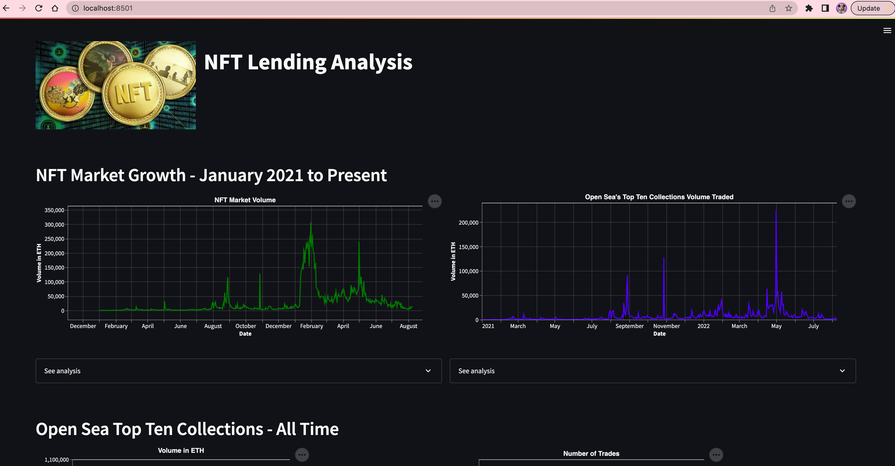

# NFT Lending Analysis

---

## BACKGROUND

A unique challenge for NFTs as an asset class is their low liquidity. Stocks, bonds, and even crypto assets like BTC and ETH (fungible tokens) have better liquidity, since there are hundreds of exchanges (centralized and decentralized) where you can sell one BTC or one ETH if you want to exchange it for fiat/cash.

However, obtaining liquidity for an NFT  relies on finding a buyer for that specific (fungible) token. There may be no-one interested in buying it, or not enough buyers willing to buy it at the floor price, or any price. There may also be remaining mintable assets (e.g. the collection did not sell out at mint) that are cheaper than the price you want to sell it for post-mint. It may also be available for sale on multiple marketplaces, each with their own floor price and trading volume.

---

## PROJECT OVERVIEW

This project seeks to perform various analyses to determine the viability of NFT Lending to address the liquidity challenges in the NFT market.

---

## INSTALLATION

1. Clone this repository by opening your terminal and entering the following commands:

```
  git clone https://github.com/jgrichardson/nft_lending.git
  cd nft_lending
```

2. Install the required pre-requisites / libraries

```
  pip install -r requirements.txt
```

3. Edit your .env file and populate the required credentials:


```
  MEANINGCLOUD_KEY=<insert your meaningcloud API key here> Obtain key at [Meaningcloud](https://www.meaningcloud.com/developer/create-account)
  TWITTER_BEARER_TOKEN=<insert your Twitter key here> Obtain key at [Twitter API](https://developer.twitter.com/en/portal/dashboard)
  DATABASE_URL=<Insert your PostgreSQL connect string here>
  RARIFY_API_KEY=<Insert your Rarify API key> Obtain key at [Rarify API](https://docs.rarify.tech/get-started/)
```

## DATABASE INSTALLATION

1. Install the database schema and system data onto a PostgreSQL database by executing the following Python scripts:

```
  database\ddl.py
  database\dml.py
---

2. Modify the period, number of contracts, and number of tokens per contract variables for data extraction from the Rarify API.  Then run the following Python script:

```
  extract_transform_load\etl.py
```

3. Schedule the etl.py script to run nightly to keep the database updated with the most current information available from the Rarify API.


## USAGE

This application runs as a python script (dashboard.py) in the Streamlit app framework. Open your terminal and type:

```
  streamlit run dashboard.py
```

Streamlit will open a browser and connect to the application at localhost:8501



---

## CONTRIBUTORS

[Michael Dionne](https://github.com/DigitalGoldRush)
[Ben Gunnels](https://github.com/miltiades-the-general)
[Drew Herrera](https://github.com/drew94591)
[Ryan Mangum](https://github.com/rrmangum)
[Greg Richardson](https://github.com/jgrichardson)
[Taofik Sulaiman](https://github.com/tosulai2)

---

## License

The source code for the application is licensed under the MIT license, which you can find in the LICENSE file in this repo.


